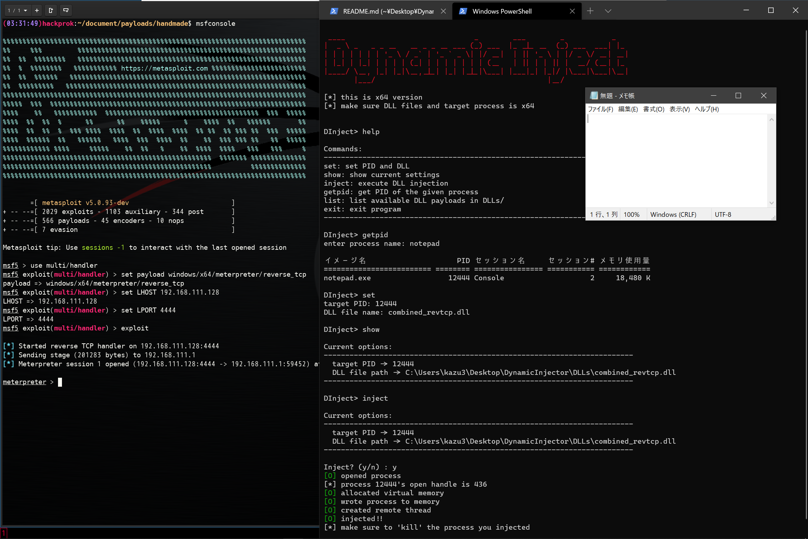

# Dynamic Inject
```
  ____                              _        ___        _           _
 |  _ \ _   _ _ __   __ _ _ __ ___ (_) ___  |_ _|_ __  (_) ___  ___| |_
 | | | | | | | '_ \ / _` | '_ ` _ \| |/ __|  | || '_ \ | |/ _ \/ __| __|
 | |_| | |_| | | | | (_| | | | | | | | (__   | || | | || |  __/ (__| |_
 |____/ \__, |_| |_|\__,_|_| |_| |_|_|\___| |___|_| |_|/ |\___|\___|\__|
        |___/                                        |__/
```

<br/>

This DynamicInject is a simple DLL Injector for Windows. It is written only in C and doesn't require any installation. This is only for Educational Purpose and not for attacking someone else's computer. I will not take any responsibility for the problem caused by this tool.


<br/>

## Usage

Before injection, you have to set your own payload in DLLs/ directory. By default, there are splitted files and comb.bat in DLLs/ and you can create sample payload by executing comb.bat. This DynamicInject only provides dll-injection function not handler so set reverse shell handler using metasploit depending on your payload. After everything is set, run injector64.exe and inject.

<br/>

## Commands
You can also get this with `help` command.
```
set: set PID and DLL
show: show current settings
inject: execute DLL injection
getpid: get PID of the given process
list: list available DLL payloads in DLLs/
exit: exit program
```

<br/>

## Other Note
* for x86 user, just compile inject.c with gcc
